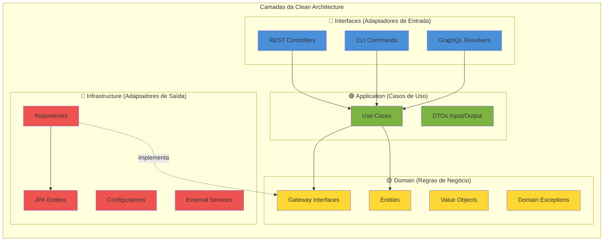
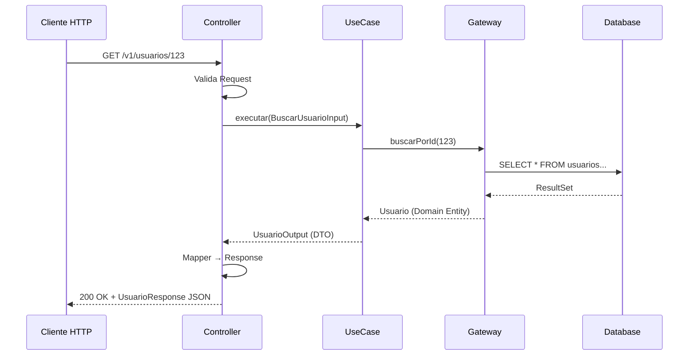

# Arquitetura do Projeto jilo-com-jurubeba

> @author Danilo Fernando

## Visão Geral

O projeto jilo-com-jurubeba segue os princípios da **Clean Architecture** (também conhecida como Hexagonal Architecture ou Ports & Adapters), proposta por Robert C. Martin (Uncle Bob).

O objetivo principal é criar um sistema onde as **regras de negócio são o centro** da aplicação, completamente isoladas de detalhes de implementação como frameworks, banco de dados e interfaces de usuário.

## Princípios Fundamentais

### 1. Independência de Frameworks
O código de negócio não depende de Spring, JPA ou qualquer outro framework. Frameworks são detalhes de implementação.

### 2. Testabilidade
As regras de negócio podem ser testadas sem UI, banco de dados, servidor web ou qualquer elemento externo.

### 3. Independência de UI
A interface do usuário pode mudar facilmente, sem alterar o restante do sistema. Uma API REST pode ser substituída por GraphQL sem impacto no domínio.

### 4. Independência de Banco de Dados
PostgreSQL pode ser trocado por MongoDB sem alterar as regras de negócio. O banco é um detalhe de implementação.

### 5. Independência de Agentes Externos
As regras de negócio não sabem nada sobre interfaces externas (APIs de terceiros, filas, etc).

---

## Diagrama de Camadas



---

## Fluxo de uma Requisição



---

## Estrutura de Pacotes

```
com.grupo3.postech.jilocomjurubeba
├── domain/                    # 🟡 Camada de Domínio (sem Spring/JPA)
│   ├── entity/               # Entidades de negócio
│   ├── valueobject/          # Value Objects imutáveis
│   ├── gateway/              # Interfaces para mundo externo
│   └── exception/            # Exceções de domínio
│
├── application/              # 🟢 Camada de Aplicação
│   ├── usecase/              # Casos de uso
│   │   └── [entidade]/       # Agrupados por entidade
│   └── dto/                  # DTOs de entrada/saída
│       └── [entidade]/
│
├── interfaces/               # 🔵 Camada de Interfaces (REST)
│   └── rest/                 # Adaptadores REST
│       ├── dto/              # Request/Response
│       ├── mapper/           # Conversores REST
│       └── handler/          # Exception handlers
│
└── infrastructure/           # 🔴 Camada de Infraestrutura
    ├── persistence/          # Implementações de persistência
    │   ├── entity/           # Entidades JPA
    │   ├── repository/       # Repositórios Spring Data
    │   ├── gateway/          # Implementações dos Gateways
    │   └── mapper/           # Conversores de persistência
    └── config/               # Configurações Spring
```

---

## Regras de Dependência

### ⛔ Dependências Proibidas

| De                | Para           | Motivo                                          |
|-------------------|----------------|-------------------------------------------------|
| domain            | application    | Domain é o centro, não conhece casos de uso     |
| domain            | interfaces     | Domain não conhece HTTP                         |
| domain            | infrastructure | Domain não conhece banco de dados               |
| application       | interfaces     | Application não conhece HTTP                    |
| application       | infrastructure | Application não conhece implementações          |
| infrastructure    | interfaces     | Não devem se conhecer                           |

### ✅ Dependências Permitidas

| De                | Para        | Motivo                                             |
|-------------------|-------------|----------------------------------------------------|
| application       | domain      | Casos de uso orquestram entidades                  |
| interfaces        | application | Controllers chamam casos de uso                    |
| interfaces        | domain      | Pode usar exceções e tipos do domínio              |
| infrastructure    | application | Implementa interfaces, pode usar DTOs              |
| infrastructure    | domain      | Implementa Gateways do domínio                     |

---

## Validação com ArchUnit

O projeto usa ArchUnit para garantir que as regras de dependência são respeitadas:

```java
@Test
void domainNaoDeveDependerDeOutrasCamadas() {
    noClasses()
        .that().resideInAPackage("com.grupo3.postech.jilocomjurubeba.domain..")
        .should().dependOnClassesThat().resideInAnyPackage(
            "com.grupo3.postech.jilocomjurubeba.application..",
            "com.grupo3.postech.jilocomjurubeba.interfaces..",
            "com.grupo3.postech.jilocomjurubeba.infrastructure.."
        )
        .check(classes);
}
```

Execute os testes de arquitetura:
```bash
mvn test -Dtest=CleanArchitectureTest
```

---

## Referências

- [Clean Architecture - Robert C. Martin](https://blog.cleancoder.com/uncle-bob/2012/08/13/the-clean-architecture.html)
- [Hexagonal Architecture - Alistair Cockburn](https://alistair.cockburn.us/hexagonal-architecture/)
